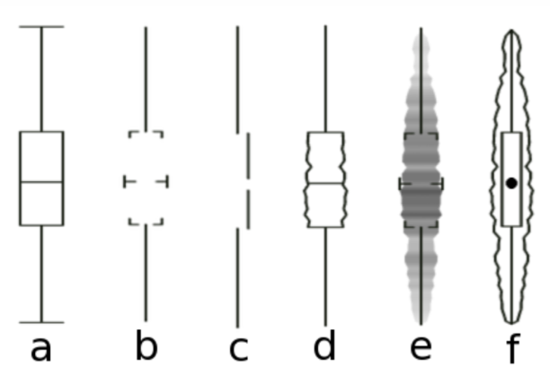
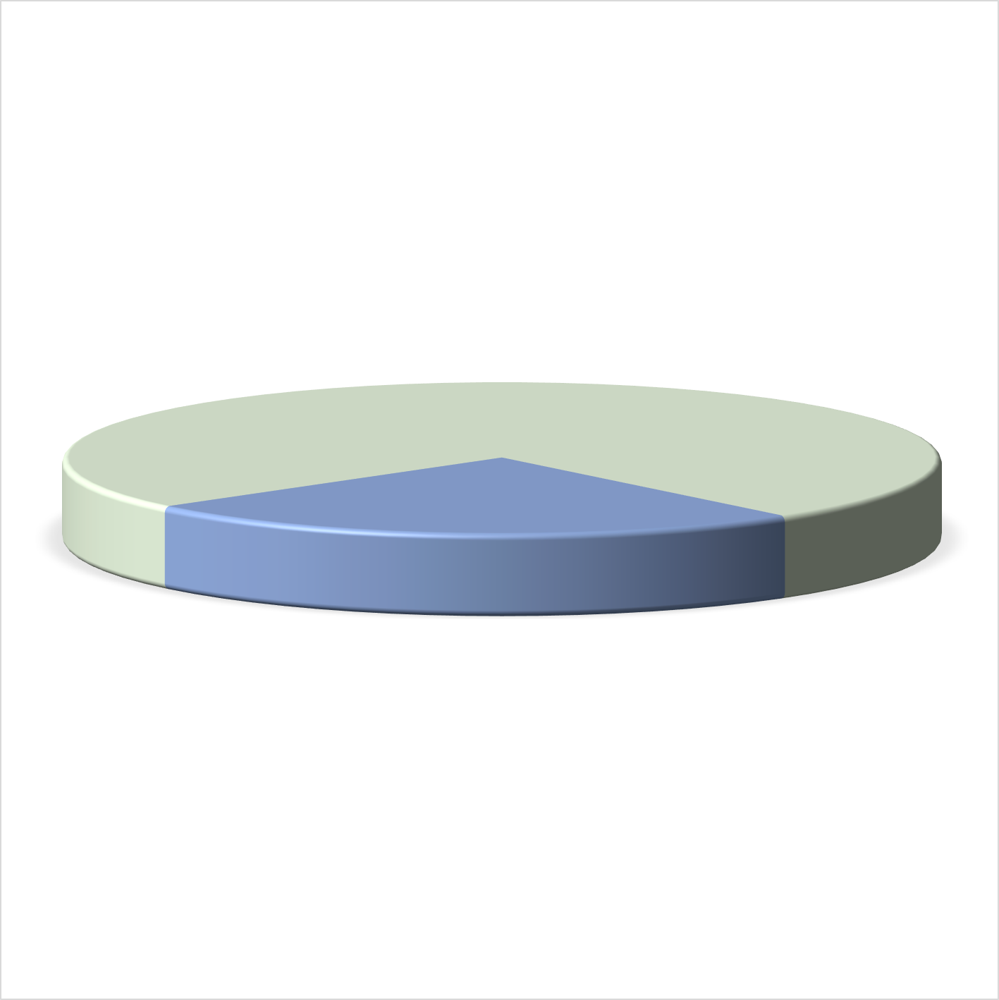

```{r include = FALSE, results = "asis"}
source(here::here("slide-setup.R"))
```

`r setup("index")`

---

```{r setup, include = FALSE}

library(tidyverse)
library(knitr)
opts_chunk$set(fig.width = 13, 
               message = FALSE, 
               warning = FALSE,
               echo = FALSE)
library(ggrepel)

source(here::here("wilke-purl", "wilke-dir-vis.R"))
source(here::here("wilke-purl", "wilke-aes-mapping.R"))
source(here::here("wilke-purl", "wilke-avoid_line_drawings.R"))
source(here::here("wilke-purl", "wilke-redundant_coding.R"))
source(here::here("wilke-purl", "wilke-proportions.R"))
source(here::here("wilke-purl", "wilke-color_basics.R"))

update_geom_defaults('path', list(size = 4))
update_geom_defaults('point', list(size = 5))
update_geom_defaults('text_repel', list(size = 6))
update_geom_defaults('text', list(size = 6))
```

# whoami

.pull-left[
* Research Assistant Professor: Behavioral Research and Teaching
* Dad (two daughters: 8 and 6)
* Pronouns: he/him/his
* Primary areas of interest: 💗💗R💗💗, computational research, achievement gaps, systemic inequities, and variance between educational institutions
]

.pull-right[


</div>
]

---
# Resources (free)

.pull-left[
[Healy](http://socviz.co)

<div>

</div>

]

.pull-right[
[Wilke](https://serialmentor.com/dataviz/)

<div>
 </div>


]


---
# Other Resources
* My classes! 
* Sequence
  + EDLD 651: Introductory Educational Data Science (EDS)
  + EDLD 652: Data Visualization for EDS
  + EDLD 653: Functional Programming for EDS
  + EDLD 654: Machine Learning for EDS
  + Capstone

---
# Where to start?
* I *really* recommend moving to R as quickly as possible

--

http://r4ds.had.co.nz

<div>

</div>


---
# ggplot2!

.pull-left[
https://r-graphics.org

]

.pull-right[
Third edition [in progress](https://ggplot2-book.org)!

]

---
# Last note before we really start
* These slides were produced with R

* See the source code [here](https://github.com/datalorax/psych-seminar19)

* The focus of this particular talk is not on the code itself

---
class: middle center
# Different ways of encoding data

```{r data-encoding, fig.width = 14}
plot_grid(aes_pos, aes_shape, aes_size,
          aes_color, aes_lwd, aes_ltp,
          ncol = 3,
          labels = c("position", "shape", "size", "color", "line width", "line type"),
          label_x = 0.05, label_y = 0.95, hjust = 0, vjust = 1, 
          label_size = 40)
```

---
# Other elements to consider
* Text
  
  + How is the text displayed (e.g., font, face, location)? 
  
  + What is the purpose of the text?

--

* Transparency
  
  + Are there overlapping pieces? 
  
  + Can transparency help?

---
# Other elements to consider
* Type of data

  + Continuous/categorical

  + Which can be mapped to each aesthetic?

    - e.g., shape and line type can only be mapped to categorical data, whereas
    color and size can be mapped to either.


---
class: middle center
# Basic Scales

```{r scales-wilke, fig.width = 14}
scale_num + scale_shape + scale_color + plot_layout(ncol = 1)
```

---
# Talk with a neighbor
How would you encode these data into a display?

| Month | Day | Location     | Temperature |
|:-----:|:---:|:-------------| ------------|
|  Jan  |  1  | Chicago      | 25.6        |
|  Jan  |  1  | San Diego    | 55.2        |
|  Jan  |  1  | Houston      | 53.9        |
|  Jan  |  1  | Death Valley | 51.0        |
|  Jan  |  2  | Chicago      | 25.5        |
|  Jan  |  2  | San Diego    | 55.3        |
|  Jan  |  2  | Houston      | 53.8        |
|  Jan  |  2  | Death Valley | 51.2        |
|  Jan  |  3  | Chicago      | 25.3        |


---
class: middle center
# Putting it to practice

```{r temp-change, fig.height = 8}
ggplot(temps_long, aes(x = date, y = temperature, color = location)) +
  geom_line(size = 1.5) +
  scale_x_date(name = "month", 
               limits = c(ymd("0000-01-01"), ymd("0001-01-04")),
               breaks = c(ymd("0000-01-01"), 
                          ymd("0000-04-01"), 
                          ymd("0000-07-01"),
                          ymd("0000-10-01"), 
                          ymd("0001-01-01")),
               labels = c("Jan", "Apr", "Jul", "Oct", "Jan"), 
               expand = c(1/366, 0)) + 
  scale_y_continuous(limits = c(15, 110),
                     breaks = seq(20, 100, by = 20),
                     name = "temperature (°F)") +
  scale_color_OkabeIto(order = c(1:3, 7), name = NULL) +
  theme_minimal(base_size = 25) +
  theme(legend.title.align = 0.5)
```

---
class: middle center
# Alternative representation

```{r temp-change2, fig.width = 14}
ggdraw(align_legend(p)) 
```

---
# Comparison

* Both represent three scales

  + Two position scales (x/y axis)
  + One color scale (categorical for the first, continuous for the second)

---
# More scales are possible

```{r five-scales}
ggdraw() + 
  draw_plot(p_mtcars + theme(legend.position = "none")) + 
  draw_grob(legend, x = .36, y = .7, width = .7, height = .2)
```

---
background-image:url(http://socviz.co/dataviz-pdfl_files/figure-html4/ch-01-multichannel-1.png)
background-size:contain

Additional scales can become lost without high structure in the data

---
class: inverse-blue middle
# Thinking more about color

---
# Three fundamental uses 

1. Distinguish groups from each other

1. Represent data values

1. Highlight


---
# Discrete items
Often no intrinsic order


--
### Qualitative color scale
* Finite number of colors
  + Chosen to maximize distinctness, while also being *equivalent*
  + Equivalent
      - No  color should stand out
      - No impression of order

---
background-image:url(https://serialmentor.com/dataviz/color_basics_files/figure-html/qualitative-scales-1.png)
background-size:contain

# Some examples

.footnote[See more about the Okabe Ito palette origins [here](http://jfly.iam.u-tokyo.ac.jp/color/)]


---
background-image:url(https://serialmentor.com/dataviz/color_basics_files/figure-html/sequential-scales-1.png)
background-size:contain

# Sequential scale examples


---
background-image:url(https://serialmentor.com/dataviz/color_basics_files/figure-html/diverging-scales-1.png)
background-size:contain

# Diverging palettes

---
# Earth palette

```{r or1, echo = FALSE}
library(tidycensus)
library(tigris)
options(tigris_use_cache = TRUE)
options(tigris_class="sf")

lane <- get_decennial(geography = "tract", variables = "P005003", 
                  state = "OR", county = "Lane", geometry = TRUE,
                  summary_var = "P001001")

or <- get_decennial(geography = "county", variables = "P005003", 
                  state = "OR", geometry = TRUE,
                  summary_var = "P001001")

ca <- get_decennial(geography = "county", variables = "P005003", 
                  state = "CA", geometry = TRUE,
                  summary_var = "P001001")


or %>%
  mutate(pct = 100 * (value / summary_value)) %>%
  ggplot(aes(fill = pct, color = pct)) +
  geom_sf() +
  coord_sf(crs = 26915) + 
  theme_dviz_map(font_size = 25,
                 font_family = "Roboto Light") +
  scale_fill_continuous_divergingx(palette = "Earth", 
                                   mid = 50, 
                                   limits = c(0, 100)) +
  scale_color_continuous_divergingx(palette = "Earth", 
                                    mid = 50,
                                    limits = c(0, 100)) +
  labs(title = "Percentage of people identifying as White",
       subtitle = "Oregon",
       caption = "US Census Decennial Tract Data")

```

---
```{r ca1, echo = FALSE, fig.height = 9}
ca %>%
  mutate(pct = 100 * (value / summary_value)) %>%
  ggplot(aes(fill = pct, color = pct)) +
  geom_sf() +
  coord_sf(crs = 26915) + 
  theme_dviz_map(font_size = 25,
                 font_family = "Roboto Light") +
  scale_fill_continuous_divergingx(palette = "Earth", 
                                   mid = 50, 
                                   limits = c(0, 100)) +
  scale_color_continuous_divergingx(palette = "Earth", 
                                    mid = 50,
                                    limits = c(0, 100)) +
  labs(title = "Percentage of people identifying as White",
       subtitle = "California",
       caption = "US Census Decennial County Data")

```

---
# Common problems 
### Too many colors

More than 5-ish generally becomes difficult to track

```{r too-many-colors}
theme_set(theme_minimal(20))
ggplot(popgrowth_df, aes(pop2000, popgrowth, color = state)) +
  geom_point()
```

---
# Use labels

still too many...

```{r states-labeled}
library(ggrepel) #<<

ggplot(popgrowth_df, aes(pop2000, popgrowth)) +
  geom_point(color = "gray70") +
  geom_text_repel(aes(label = state)) #<<
```

---
# Better

Get a subset

```{r subset-states}
to_label <- c("Alaska", "Arizona", "California", "Florida", "Wisconsin", 
              "Louisiana", "Nevada", "Michigan", "Montana", "New Mexico", 
              "Pennsylvania", "New York", "Oregon", "Rhode Island",
              "Tennessee", "Texas", "Utah", "Vermont")
subset_states <- popgrowth_df %>%
  filter(state %in% to_label)

ggplot(popgrowth_df, aes(pop2000, popgrowth)) +
  geom_point(color = "gray70") +
  geom_text_repel(aes(label = state), data = subset_states) 
```

---
# Best
(but could still be improved)

```{r best-label}
ggplot(popgrowth_df, aes(pop2000, popgrowth)) +
  geom_point(color = "gray70") +
  geom_point(color = "#DC5265", data = subset_states) +
  geom_text_repel(aes(label = state), 
                  data = subset_states,
                  min.segment.length = 0,
                  box.padding = 0.5,
                  color = "gray40") 
```

---
# Problem w/ default palette 
### For {ggplot2}
```{r colorblind1, echo = FALSE, fig.height = 8}
p <- ggplot(popgrowth_df, 
       aes(x = state, 
           y = 100*popgrowth)) + 
  geom_col(aes(fill = region),
           alpha = 0.7) + 
  coord_flip() +
  theme_void()
colorblindr::cvd_grid(p)
```

---
# Alternative: viridis

```{r viridis1, fig.height = 8.25}
ggplot(popgrowth_df, 
       aes(x = state, 
           y = 100*popgrowth)) + 
  geom_col(aes(fill = region),
           alpha = 0.7) + 
  scale_y_continuous(expand = c(0, 0)) +
  scale_fill_viridis_d() + 
  coord_flip() +
  theme_minimal(12)
```

---
# Revised version

```{r echo = FALSE, fig.height = 8}
p2 <- ggplot(popgrowth_df, 
       aes(x = state, 
           y = 100*popgrowth)) + 
  geom_col(aes(fill = region),
           alpha = 0.7) + 
  coord_flip() +
  scale_fill_viridis_d() +
  theme_void()

colorblindr::cvd_grid(p2)
```

---
# Last few note on palettes
* Do some research, find what you like .bold[and] what tends to work well

* Check for colorblindness

* Look into http://colorbrewer2.org/ 

---
class: inverse-blue middle
# Data ink ratio

---
# What is it?

--
> ### Above all else,  show the data

<br>
\-Edward Tufte


--
* Data-Ink Ratio = Ink devoted to the data / total ink used to produce the
figure


--
* Common goal: Maximize the data-ink ratio

---
# Example



--

* First thought might be... Cool!

---
background-image:url(https://theamericanreligion.files.wordpress.com/2012/10/lee-corso-sucks.jpeg?w=660)
background-size:cover

---
# Minimize cognitive load
* Empirically, Tufte's plot was .bolder[the most difficult] for viewers to
interpret.


--
* Visual cues (labels, gridlines) reduce the data-ink ratio, but can also 
reduce cognitive load.

---
# An example
### Which do you prefer?

.pull-left[
```{r h3_bad, fig.width = 6}
h3_bad 
```
]

.pull-right[
```{r h3_good, fig.width = 6}
h3_good 
```
]


---
# Advice from Wilke

> Whenever possible, **visualize your data with solid, colored shapes** rather than with lines that outline those shapes. Solid shapes are more easily perceived, are less likely to create visual artifacts or optical illusions, and do more immediately convey amounts than do outlines.

.gray[emphasis added]

---
# Another example

.pull-left[
```{r iris_lines, fig.width = 6}
iris_lines
```
]

.pull-right[
```{r iris_colored_lines, fig.width = 6}
iris_colored_lines
```
]

---
class: center middle

```{r iris_filled}
iris_filled
```

---
# Labels in place of legends

Prior slide is a great example of when annotations can be used in place of a legend to 
* reduce cognitive load
* increase clarity
* increase beauty
* maximize the figure size

---
class: inverse-red  middle
# Practical advice so far

---
class: inverse-red middle
## Avoid line drawings

<br>

--
## Maximize the data-ink ratio within reason (but preference reduction of cognitive load)


---
class: inverse-red middle

## Use color to your advantage (and think critically about the palettes you choose)

<br>

--

## Consider plot annotations over legends

---
class: inverse-blue middle
# Grouped data

---
# Distributions

How do we display more than one distribution at a time?

```{r theme-update-icon, include = FALSE}
knitr::opts_chunk$set(echo = FALSE)
theme_update(axis.text.x = element_blank(),
             axis.text.y = element_blank(),
             axis.title.x = element_blank(),
             axis.title.y = element_blank(),
             legend.position = "none")
```


---
# Boxplots

```{r boxplots}
boxplots
```

---
# Violin plots

```{r violin}
violin
```

---
# Jittered points

```{r jittered}
jittered
```

---
# Sina plots

```{r sina}
sina
```

---
# Stacked histograms

```{r stacked-histo}
stacked_histo
```

---
# Overlapping densities

```{r overlap-dens}
overlap_dens
```

---
# Ridgeline densities

```{r ridgeline}
ridgeline
```

```{r opts3, include = FALSE}
theme_set(theme_minimal(base_size = 25))
```

---
class: inverse-red middle
# Quick empirical examples


---
# Titanic data

```{r titanic-data}
as_tibble(titanic)
```


---
# Boxplots

```{r boxplots-empirical}
ggplot(titanic, aes(sex, age)) +
  geom_boxplot(fill = 'cornflowerblue',
               alpha = 0.7)
```

---
# Violin plots

```{r violin-empirical}
ggplot(titanic, aes(sex, age)) +
  geom_violin(fill = 'cornflowerblue',
               alpha = 0.7)
```

---
# Jittered point plots

```{r jittered-empirical}
ggplot(titanic, aes(sex, age)) +
  geom_jitter(width = 0.3,
              color = "cornflowerblue")
```

---
# Sina plot

```{r sina-empirical}
ggplot(titanic, aes(sex, age)) +
  ggforce::geom_sina(color = "cornflowerblue")
```

---
# Stacked histogram

```{r stacked-histo-empirical, message = FALSE, fig.height = 6}
ggplot(titanic, aes(age)) +
  geom_histogram(aes(fill = sex))
```

--

.realbig[🤨]

---
# Dodged
```{r dodged-histo-empirical, message = FALSE}
ggplot(titanic, aes(age)) +
  geom_histogram(aes(fill = sex), 
                 position = "dodge")
```

---
# Better

```{r wrapped-histo-empirical, message = FALSE}
ggplot(titanic, aes(age)) +
  geom_histogram(fill = "#56B4E9",
                 color = "white",
                 alpha = 0.7,) +
  facet_wrap(~sex) +
  scale_y_continuous(breaks = seq(0, 50, 15)) +
  theme_dviz_hgrid(font_size = 25, font_family = "Roboto Light")
```

---
# Overlapping densities

```{r overlap-dens-empirical}
ggplot(titanic, aes(age)) +
  geom_density(aes(fill = sex),
               color = "white",
               alpha = 0.4)
```

--
Note the default colors really don't work well in most of these

---
class: center middle

```{r overlap-dens-empirical2, fig.height = 8}
ggplot(titanic, aes(age)) +
  geom_density(aes(fill = sex),
               color = "white",
               alpha = 0.4) +
  scale_fill_manual(values = c("#003d99", "#3888ff"))
```

---
# Ridgeline densities

```{r ridgeline-dens-empirical}
ggplot(titanic, aes(age, sex)) +
  ggridges::geom_density_ridges(color = "white",
                                fill = "#003F9C") +
  scale_y_discrete(expand = c(0, 0)) 
```

---
class: inverse-blue middle
# Visualizing amounts

---
# Bar plots

```{r theme-update, include = FALSE}
knitr::opts_chunk$set(echo = FALSE)
theme_update(axis.text.x = element_blank(),
             axis.text.y = element_blank(),
             axis.title.x = element_blank(),
             axis.title.y = element_blank(),
             legend.position = "none")
```

```{r bars}
bars
```

---
# Flipped bars

```{r flipped_bars}
flipped_bars
```

---
# Dotplot

```{r dots}
dots
```

---
# Heatmap

```{r heatmap}
heatmap
```

---
class: inverse-red middle
# A short journey
### How much does college cost?

```{r opts4, include = FALSE}
theme_set(theme_minimal(base_size = 25))
```
---
# Tuition data

```{r load_tuition}
library(here)
library(rio)
tuition <- import(here("data", "us_avg_tuition.xlsx"),
                  setclass = "tbl_df")
head(tuition)
```

---
# By state: 2015-16
```{r state-tuition1, fig.height = 6}
ggplot(tuition, aes(State, `2015-16`)) +
  geom_col()
```

--

.realbig[🤮🤮🤮]

---
# Two puke emoji version

.pls[
.realbig[🤮🤮]
]

.prb[
```{r state-tuition2, fig.height = 9}
ggplot(tuition, aes(State, `2015-16`)) +
  geom_col() +
  theme(axis.text.x = element_text(angle = 45, hjust = 1, size = 10))
```
]
---
# One puke emoji version


.pls[
.realbig[🤮]
]

.prb[
```{r state-tuition3-eval, fig.height = 10}
ggplot(tuition, aes(State, `2015-16`)) +
  geom_col() +
  coord_flip() +
  theme(axis.text.y = element_text(size = 13))
```
]

---
# Kinda smiley version

.pls[
.realbig[😏]
]
.prb[
```{r state-tuition4-eval, fig.height = 10}
ggplot(tuition, aes(fct_reorder(State, `2015-16`), `2015-16`)) +
  geom_col() +
  coord_flip() +
  theme(axis.text.y = element_text(size = 13))
```
]

---
# Highlight Oregon

.pls[
.realbig[🙂]
]
.prb[
```{r oregon-highlight-eval, echo = FALSE, fig.height = 10}
ggplot(tuition, aes(fct_reorder(State, `2015-16`), `2015-16`)) +
  geom_col() +
  geom_col(fill = "cornflowerblue", 
           data = filter(tuition, State == "Oregon")) +
  coord_flip() +
  scale_y_continuous(expand = c(0, 0)) +
  theme(axis.text.y = element_text(size = 13))
```
]

---
# Not always good to sort

```{r income_df-sorted, echo = FALSE}
income_by_age %>% 
filter(race == "all") %>%
  ggplot(aes(x = fct_reorder(age, desc(median_income)), y = median_income)) +
    geom_col() +
    scale_y_continuous(
      expand = c(0, 0),
      name = "median income (USD)",
      breaks = c(0, 20000, 40000, 60000),
      labels = c("$0", "$20,000", "$40,000", "$60,000")
    ) +
    coord_cartesian(clip = "off") +
    xlab("age (years)") 
```

---
# Much better

```{r income_df, echo = FALSE}
income_by_age %>% 
filter(race == "all") %>%
  ggplot(aes(x = age, y = median_income)) +
    geom_col() +
    scale_y_continuous(
      expand = c(0, 0),
      name = "median income (USD)",
      breaks = c(0, 20000, 40000, 60000),
      labels = c("$0", "$20,000", "$40,000", "$60,000")
    ) +
    coord_cartesian(clip = "off") +
    xlab("age (years)") 
```

---
# Heatmap

```{r heatmap2-eval, echo = FALSE, fig.height = 9.5}
tuition_l <- tuition %>%
  gather(year, avg_tuition, -State)
ggplot(tuition_l, aes(year, State)) +
  geom_tile(aes(fill = avg_tuition)) +
  theme_minimal(base_size = 12)
```

---
# Better heatmap

```{r heatmap3-eval, echo = FALSE, fig.height = 9.5}
ggplot(tuition_l, aes(year, fct_reorder(State, avg_tuition))) +
  geom_tile(aes(fill = avg_tuition)) +
  theme_minimal(base_size = 12)
```

---
# Even better?

```{r heatmap5-eval, echo = FALSE, fig.height = 9.5}
ggplot(tuition_l, aes(year, fct_reorder(State, avg_tuition))) +
  geom_tile(aes(fill = avg_tuition)) +
  colorspace::scale_fill_continuous_sequential(
    palette = "Purples"
  ) +
  theme_minimal(base_size = 12)
```


---
# Or maybe this one?

```{r heatmap4-eval, echo = FALSE, fig.height = 9.5}
ggplot(tuition_l, aes(year, fct_reorder(State, avg_tuition))) +
  geom_tile(aes(fill = avg_tuition)) +
  scale_fill_viridis_c(option = "magma") +
  theme_minimal(base_size = 12)
```


---
background-image: url("img/heatmap.png")
class: inverse-blue
background-size:contain


---
# Quick aside
* Think about the data you have
* Given that these are state-level data, they have a geographic component

---
background-image: url("img/states-heatmap.png")
class: inverse bottom
background-size:contain


---
class: inverse-blue center middle
# Some things to avoid

---
# Line drawings
### As discussed earlier

.pull-left[
###  😫
```{r dens-titanic, fig.width = 8}
ggplot(titanic, aes(age)) +
  geom_density()
```
]

.pull-right[
### Change the fill
```{r dens-titanic-blue, fig.width = 8}
ggplot(titanic, aes(age)) +
  geom_density(fill = "#56B4E9")
```
]


---
class: middle 

.pull-left[
```{r iris_lines2, fig.width = 8}
iris_lines
```
]

.pull-right[
```{r iris_filled2, fig.width = 8}
iris_filled
```
]


---
# Much worse
### Unnecessary 3D

.pull-left[

]

.pull-right[

]

---
# Much worse
### Unnecessary 3D

.pull-left[

]

.pull-right[

]


---
# Horrid example
### Used relatively regularly


---
# Pie charts
### Especially w/lots of categories


---
# Alternative representation


---
# A case for pie charts
* $n$ categories low,
* differences are relatively large
* familiar for some audiences 

```{r pie, fig.height = 4, fig.width = 10}
wilke_pie
```

---
# The anatomy of a pie chart
Pie charts are just stacked bar charts with a radial coordinate system

```{r stacked_bars_nopie}
ggdraw(bt_bars_stacked)
```

---
# Horizontal

```{r horiz_stacked}
ggdraw(bt_bars_hstacked)
```

---
# My preference

```{r dodged_bars, fig.height = 4}
bt_bars

ggplot(bundestag, aes(x = fct_reorder(factor(party, levels = bundestag$party), seats), 
                      y = seats, 
                      fill = party)) + 
  geom_col() + 
  geom_text(aes(label = seats), size = 10, hjust = 1.2, color = c("white", "white", "black")) +
  scale_x_discrete(name = NULL) +
  scale_y_continuous(expand = c(0, 0)) +
  scale_fill_manual(values = bundestag$colors[order(bundestag$party)], guide = "none") + 
  theme_dviz_grid(25, font_family = "Roboto Light") +
  theme(axis.ticks.x = element_blank()) +
  coord_flip()
```

---
# Dual axes
* Exception: if second axis is a direct transformation of the first


.footnote[See many examples [here](http://www.tylervigen.com/spurious-correlations)


---
# Truncated axes


---
class: middle


---
# Not always a bad thing
> It is tempting to lay down inflexible rules about what to do in terms of producing your graphs, and to dismiss people who don’t follow them as producing junk charts or lying with statistics. But being honest with your data is a bigger problem than can be solved by rules of thumb about making graphs. In this case there is a moderate level of agreement that bar charts should generally include a zero baseline (or equivalent) given that bars encode their variables as lengths. But it would be a mistake to think that a dot plot was by the same token deliberately misleading, just because it kept itself to the range of the data instead.

---
class: middle


---
class: middle


---
# Scaling issues


---
class: middle center
# Poor binning choices


---
class: inverse-blue middle
# Conclusions 

## Practical takeaways to make better visualizations

---
1. Avoid line drawings

2. Sort bar charts in ascending/descending order as long as the other axis does not have implicit meaning

3. Consider dropping legends and using annotations, when possible

4. Use color to your advantage, but be sensitive to color-blindness, and use the right kind of palette

5. Consider double-encoding data (shapes and color)

6. Make your labels bigger! .gray[Didn't talk about this one much but it's super common and really important]


---
# Some things to avoid

* Essentially never

  + Use dual axes (produce separate plots instead)

  + Use 3D unnecessarily

* Be wary of

  + Truncated axes

  + Pie charts (particularly with lots of categories)


---
class: inverse-green middle

# Thanks!

## Questions?

`r icons::feather_icons("twitter")` [@datalorax_](https://twitter.com/datalorax_)
`r icons::feather_icons("github")` [@datalorax](https://github.com/datalorax)
`r icons::feather_icons("globe")` [website](www.datalorax.com)
`r icons::feather_icons("mail")` [daniela@uoregon.edu](mailto:daniela@uoregon.edu)
